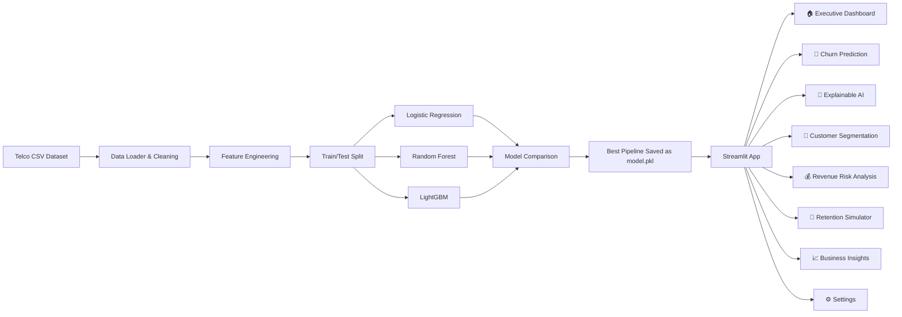

# Architecture Diagram

```mermaid
flowchart LR
    A[Telco CSV Dataset] --> B[Data Loader & Cleaning]
    B --> C[Feature Engineering]
    C --> D[Train/Test Split]
    D --> E1[Logistic Regression]
    D --> E2[Random Forest]
    D --> E3[LightGBM]
    E1 --> F[Model Comparison]
    E2 --> F
    E3 --> F
    F --> G[Best Pipeline Saved as model.pkl]
    G --> H[Streamlit App]
    H --> I[🏠 Executive Dashboard]
    H --> J[🔮 Churn Prediction]
    H --> K[🧠 Explainable AI]
    H --> L[👥 Customer Segmentation]
    H --> M[💰 Revenue Risk Analysis]
    H --> N[🎯 Retention Simulator]
    H --> O[📈 Business Insights]
    H --> P[⚙ Settings]
```
