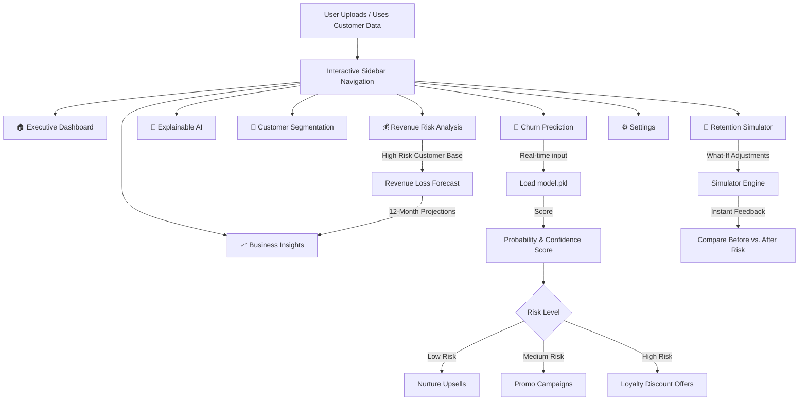

# Workflow Diagram

```mermaid
flowchart TD
    U[User Uploads / Uses Customer Data] --> P[Interactive Sidebar Navigation]
    P --> P1[🏠 Executive Dashboard]
    P --> P2[🔮 Churn Prediction]
    P --> P3[🧠 Explainable AI]
    P --> P4[👥 Customer Segmentation]
    P --> P5[💰 Revenue Risk Analysis]
    P --> P6[🎯 Retention Simulator]
    P --> P7[📈 Business Insights]
    P --> P8[⚙ Settings]
    
    P2 -->|Real-time input| M[Load model.pkl]
    M -->|Score| S[Probability & Confidence Score]
    S --> R{Risk Level}
    R -->|Low Risk| L[Nurture Upsells]
    R -->|Medium Risk| N[Promo Campaigns]
    R -->|High Risk| H[Loyalty Discount Offers]
    
    P6 -->|What-If Adjustments| SIM[Simulator Engine]
    SIM -->|Instant Feedback| S2[Compare Before vs. After Risk]
    
    P5 -->|High Risk Customer Base| REV[Revenue Loss Forecast]
    REV -->|12-Month Projections| P7
```
